# 🔄 توثيق دوائر تدفق البيانات الشاملة - DATA FLOW DOCUMENTATION

**تاريخ التوثيق:** 2026-01-16  
**المشروع:** Adora Hotel Management System  
**القائد التقني:** Senior Full-Stack Engineer  
**الحالة:** ✅ **DOCUMENTATION COMPLETE**

---

## 📋 نظرة عامة

### 🎯 الهدف
توثيق كامل لجميع دوائر تدفق البيانات (Data Flow Circles) في النظام، بما في ذلك:
- Request Lifecycle
- Room Status Cycle
- Check-in/Check-out Flow
- Points Award Flow
- QR Code Flow
- Notification Flow
- Laundry Flow
- Lost & Found Flow
- Maintenance Flow

---

## 🔄 القسم 1: REQUEST LIFECYCLE (دورة حياة الطلب)

### 🎯 الهدف
**إدارة دورة حياة الطلب من الإنشاء إلى الإنجاز مع تتبع الكامل للرحلة بين الأقسام.**

### 📊 State Machine

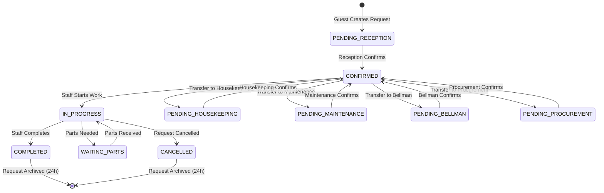
```mermaid
stateDiagram-v2
    [*] --> PENDING_RECEPTION: Guest Creates Request
    PENDING_RECEPTION --> CONFIRMED: Reception Confirms
    CONFIRMED --> IN_PROGRESS: Staff Starts Work
    IN_PROGRESS --> COMPLETED: Staff Completes
    CONFIRMED --> PENDING_HOUSEKEEPING: Transfer to Housekeeping
    CONFIRMED --> PENDING_MAINTENANCE: Transfer to Maintenance
    CONFIRMED --> PENDING_BELLMAN: Transfer to Bellman
    CONFIRMED --> PENDING_PROCUREMENT: Transfer to Procurement
    PENDING_HOUSEKEEPING --> CONFIRMED: Housekeeping Confirms
    PENDING_MAINTENANCE --> CONFIRMED: Maintenance Confirms
    PENDING_BELLMAN --> CONFIRMED: Bellman Confirms
    PENDING_PROCUREMENT --> CONFIRMED: Procurement Confirms
    IN_PROGRESS --> WAITING_PARTS: Parts Needed
    WAITING_PARTS --> IN_PROGRESS: Parts Received
    IN_PROGRESS --> CANCELLED: Request Cancelled
    COMPLETED --> [*]: Request Archived (24h)
    CANCELLED --> [*]: Request Archived (24h)
```

### 🔄 Data Flow

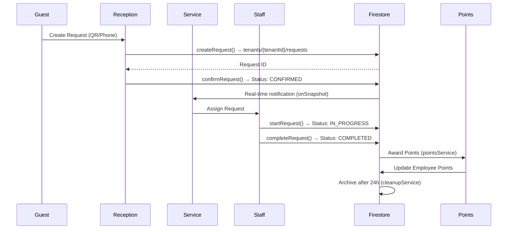
```mermaid
sequenceDiagram
    participant Guest
    participant Reception
    participant Service
    participant Staff
    participant Firestore
    participant Points

    Guest->>Reception: Create Request (QR/Phone)
    Reception->>Firestore: createRequest() → tenants/{tenantId}/requests
    Firestore-->>Reception: Request ID
    Reception->>Firestore: confirmRequest() → Status: CONFIRMED
    Firestore->>Service: Real-time notification (onSnapshot)
    Service->>Staff: Assign Request
    Staff->>Firestore: startRequest() → Status: IN_PROGRESS
    Staff->>Firestore: completeRequest() → Status: COMPLETED
    Firestore->>Points: Award Points (pointsService)
    Points->>Firestore: Update Employee Points
    Firestore->>Firestore: Archive after 24h (cleanupService)
```

### 📝 Business Rules

**1. Request Creation:**
- ✅ Status: `PENDING_RECEPTION` (default)
- ✅ Department: Determined by request type
- ✅ Target Time: Intelligent assignment (procurement)

**2. Request Confirmation:**
- ✅ Reception confirms → Status: `CONFIRMED`
- ✅ Points awarded: Reception receives confirmation points
- ✅ Real-time notification sent to department

**3. Request Assignment:**
- ✅ Staff assigned → `assignedTo` field updated
- ✅ Auto-assignment: Based on workload and rating

**4. Request Completion:**
- ✅ Staff completes → Status: `COMPLETED`
- ✅ Points awarded: Performance-based points
- ✅ Rating collected: Guest can rate service

**5. Request Archival:**
- ✅ 24 hours after completion → Moved to archive
- ✅ Points calculated: Final points calculation

---

## 🏠 القسم 2: ROOM STATUS CYCLE (دورة حالة الغرفة)

### 🎯 الهدف
**إدارة حالة الغرفة طوال رحلة النزيل من الحجز إلى الخروج.**

### 📊 State Machine

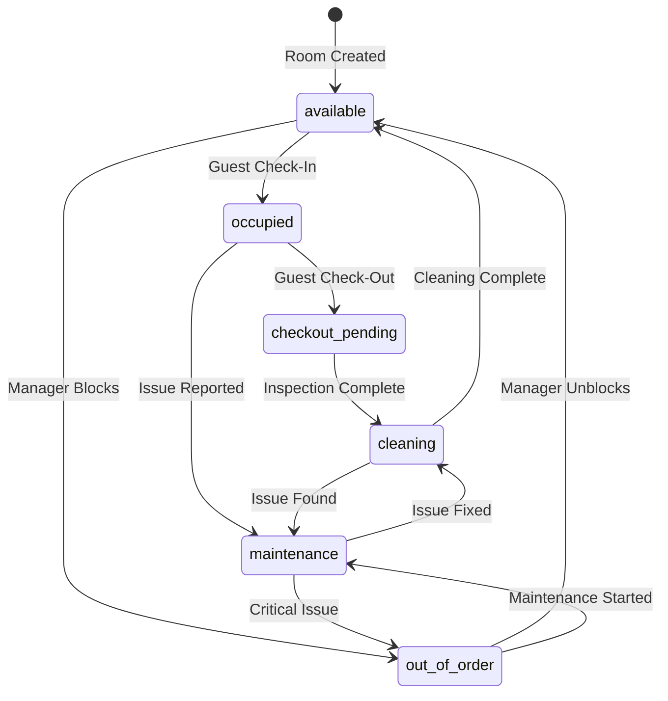
```mermaid
stateDiagram-v2
    [*] --> available: Room Created
    available --> occupied: Guest Check-In
    occupied --> checkout_pending: Guest Check-Out
    checkout_pending --> cleaning: Inspection Complete
    cleaning --> available: Cleaning Complete
    occupied --> maintenance: Issue Reported
    maintenance --> cleaning: Issue Fixed
    cleaning --> maintenance: Issue Found
    available --> out_of_order: Manager Blocks
    out_of_order --> available: Manager Unblocks
    maintenance --> out_of_order: Critical Issue
    out_of_order --> maintenance: Maintenance Started
```

### 🔄 Data Flow

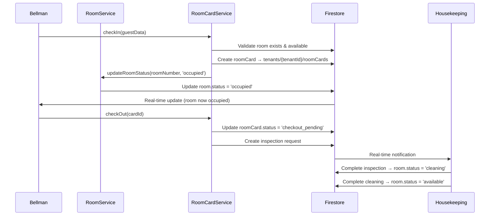
```mermaid
sequenceDiagram
    participant Bellman
    participant RoomService
    participant RoomCardService
    participant Firestore
    participant Housekeeping

    Bellman->>RoomCardService: checkIn(guestData)
    RoomCardService->>Firestore: Validate room exists & available
    RoomCardService->>Firestore: Create roomCard → tenants/{tenantId}/roomCards
    RoomCardService->>RoomService: updateRoomStatus(roomNumber, 'occupied')
    RoomService->>Firestore: Update room.status = 'occupied'
    Firestore->>Bellman: Real-time update (room now occupied)
    
    Bellman->>RoomCardService: checkOut(cardId)
    RoomCardService->>Firestore: Update roomCard.status = 'checkout_pending'
    RoomCardService->>Firestore: Create inspection request
    Firestore->>Housekeeping: Real-time notification
    Housekeeping->>Firestore: Complete inspection → room.status = 'cleaning'
    Housekeeping->>Firestore: Complete cleaning → room.status = 'available'
```

### 📝 Business Rules

**1. Check-In:**
- ✅ Room must be `available` (not `occupied`, `maintenance`, `out_of_order`)
- ✅ Creates `roomCard` with status `active`
- ✅ Updates room status to `occupied`
- ✅ Enables QR access for guest

**2. Check-Out:**
- ✅ Updates `roomCard` status to `checkout_pending`
- ✅ Creates inspection request (Housekeeping)
- ✅ Disables QR access

**3. Room Status Transitions:**
- ✅ `available` → `occupied` (Check-in only)
- ✅ `occupied` → `checkout_pending` (Check-out only)
- ✅ `checkout_pending` → `cleaning` (Inspection complete)
- ✅ `cleaning` → `available` (Cleaning complete)
- ✅ `occupied` → `maintenance` (Issue reported)
- ✅ `maintenance` → `cleaning` (Issue fixed)
- ✅ `available` → `out_of_order` (Manager blocks)

---

## 🎁 القسم 3: POINTS AWARD FLOW (تدفق منح النقاط)

### 🎯 الهدف
**منح النقاط للموظفين بناءً على الأداء والسرعة وجودة العمل.**

### 🔄 Data Flow

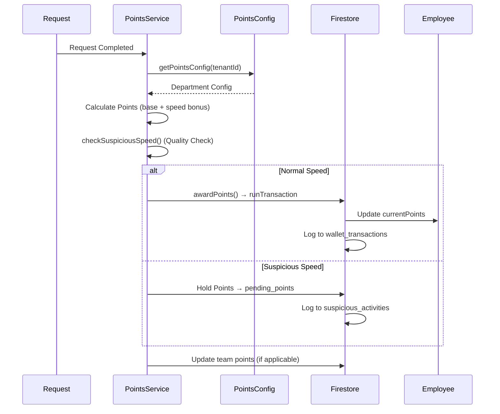
```mermaid
sequenceDiagram
    participant Request
    participant PointsService
    participant PointsConfig
    participant Firestore
    participant Employee

    Request->>PointsService: Request Completed
    PointsService->>PointsConfig: getPointsConfig(tenantId)
    PointsConfig-->>PointsService: Department Config
    PointsService->>PointsService: Calculate Points (base + speed bonus)
    PointsService->>PointsService: checkSuspiciousSpeed() (Quality Check)
    
    alt Normal Speed
        PointsService->>Firestore: awardPoints() → runTransaction
        Firestore->>Employee: Update currentPoints
        Firestore->>Firestore: Log to wallet_transactions
    else Suspicious Speed
        PointsService->>Firestore: Hold Points → pending_points
        Firestore->>Firestore: Log to suspicious_activities
    end
    
    PointsService->>Firestore: Update team points (if applicable)
```

### 📝 Business Rules

**1. Base Points:**
- ✅ Bellman: Check-in (1), Check-out (1), Complete (1)
- ✅ Housekeeping: Start (1), Complete Occupied (1), Complete Checkout (1), Inspection (1)
- ✅ Reception: Create (2), Confirm (1), Complete (1)

**2. Speed Bonus:**
- ✅ Fast: +2 points (completed in < target time)
- ✅ Delay: -1 point (completed in > delay time)

**3. Quality Check:**
- ✅ Suspicious Speed: Points held for review
- ✅ Quality Score: Based on rating and speed

**4. Transaction Integrity:**
- ✅ Uses `runTransaction` for financial integrity
- ✅ Updates personal points + team points atomically

---

## 📱 القسم 4: QR CODE FLOW (تدفق QR Code)

### 🎯 الهدف
**إنشاء وتأكيد QR Codes الآمنة للوصول إلى الخدمات والغرف.**

### 🔄 Data Flow

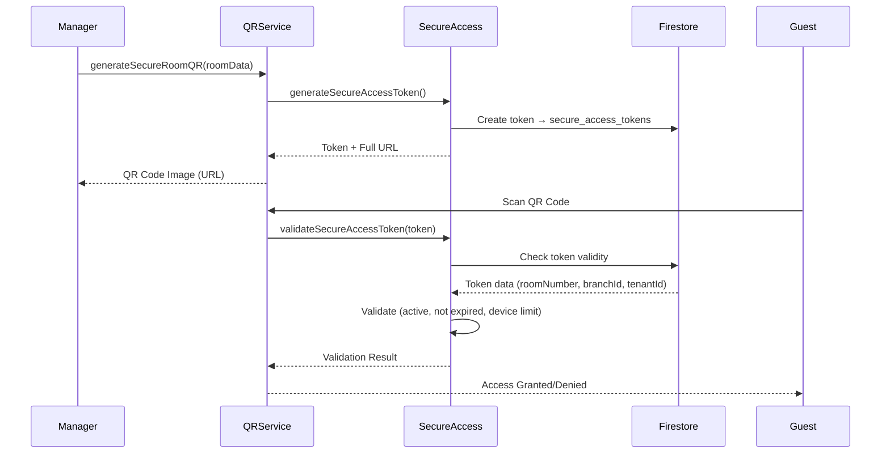
```mermaid
sequenceDiagram
    participant Manager
    participant QRService
    participant SecureAccess
    participant Firestore
    participant Guest

    Manager->>QRService: generateSecureRoomQR(roomData)
    QRService->>SecureAccess: generateSecureAccessToken()
    SecureAccess->>Firestore: Create token → secure_access_tokens
    SecureAccess-->>QRService: Token + Full URL
    QRService-->>Manager: QR Code Image (URL)

    Guest->>QRService: Scan QR Code
    QRService->>SecureAccess: validateSecureAccessToken(token)
    SecureAccess->>Firestore: Check token validity
    Firestore-->>SecureAccess: Token data (roomNumber, branchId, tenantId)
    SecureAccess->>SecureAccess: Validate (active, not expired, device limit)
    SecureAccess-->>QRService: Validation Result
    QRService-->>Guest: Access Granted/Denied
```

### 📝 Business Rules

**1. Token Generation:**
- ✅ Cryptographically secure token (32 chars)
- ✅ Stored in `secure_access_tokens` collection
- ✅ Links to room card (if checked in)
- ✅ Device fingerprinting (max devices configurable)

**2. Token Validation:**
- ✅ Token must be active (`isActive: true`)
- ✅ Token must not be expired (if expiry set)
- ✅ Room must be checked in (if room-specific)
- ✅ Device limit check (max devices)

**3. Security:**
- ✅ Prevents IDOR attacks (no room number in URL)
- ✅ Token-based access only
- ✅ Auto-deactivation on checkout

---

## 🔔 القسم 5: NOTIFICATION FLOW (تدفق الإشعارات)

### 🎯 الهدف
**إرسال إشعارات متعددة القنوات للطلبات والأحداث المهمة.**

### 🔄 Data Flow

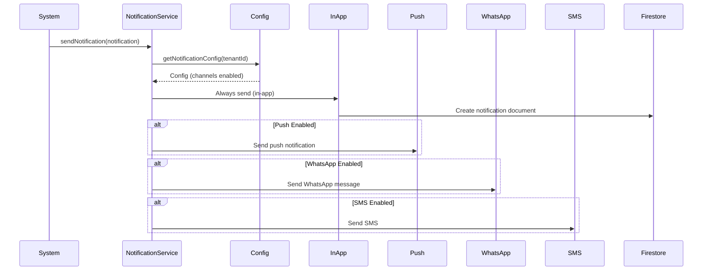
```mermaid
sequenceDiagram
    participant System
    participant NotificationService
    participant Config
    participant InApp
    participant Push
    participant WhatsApp
    participant SMS

    System->>NotificationService: sendNotification(notification)
    NotificationService->>Config: getNotificationConfig(tenantId)
    Config-->>NotificationService: Config (channels enabled)
    
    NotificationService->>InApp: Always send (in-app)
    InApp->>Firestore: Create notification document
    
    alt Push Enabled
        NotificationService->>Push: Send push notification
    end
    
    alt WhatsApp Enabled
        NotificationService->>WhatsApp: Send WhatsApp message
    end
    
    alt SMS Enabled
        NotificationService->>SMS: Send SMS
    end
```

### 📝 Business Rules

**1. Notification Channels:**
- ✅ In-app: Always sent (real-time)
- ✅ Push: Optional (browser/mobile)
- ✅ WhatsApp: Optional (if configured)
- ✅ SMS: Optional (if configured)

**2. Notification Types:**
- ✅ `info`: General information
- ✅ `success`: Success messages
- ✅ `warning`: Warning messages
- ✅ `error`: Error messages

**3. Notification Queue:**
- ✅ Failed notifications queued
- ✅ Retry logic for failed notifications
- ✅ Processed when provider configured

---

## 🧺 القسم 6: LAUNDRY FLOW (تدفق الغسيل)

### 🎯 الهدف
**إدارة مخزون الغسيل والربط مع الغرف والطلبات.**

### 🔄 Data Flow

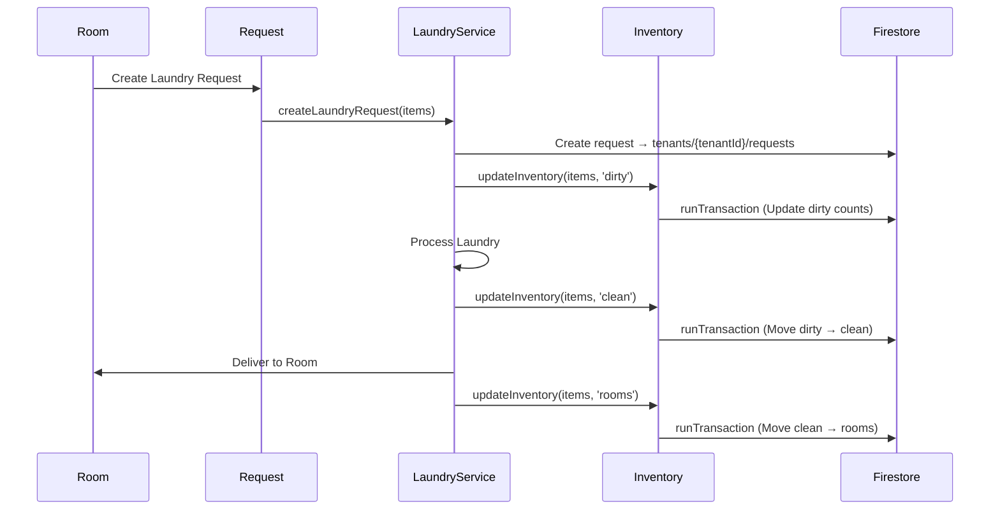
```mermaid
sequenceDiagram
    participant Room
    participant Request
    participant LaundryService
    participant Inventory
    participant Firestore

    Room->>Request: Create Laundry Request
    Request->>LaundryService: createLaundryRequest(items)
    LaundryService->>Firestore: Create request → tenants/{tenantId}/requests
    LaundryService->>Inventory: updateInventory(items, 'dirty')
    Inventory->>Firestore: runTransaction (Update dirty counts)
    
    LaundryService->>LaundryService: Process Laundry
    LaundryService->>Inventory: updateInventory(items, 'clean')
    Inventory->>Firestore: runTransaction (Move dirty → clean)
    
    LaundryService->>Room: Deliver to Room
    LaundryService->>Inventory: updateInventory(items, 'rooms')
    Inventory->>Firestore: runTransaction (Move clean → rooms)
```

### 📝 Business Rules

**1. Inventory States:**
- ✅ `stockRooms`: Clean items in rooms
- ✅ `inLaundry`: Items being laundered
- ✅ `dirty`: Dirty items collected
- ✅ `inTreatment`: Items being treated

**2. Inventory Flow:**
- ✅ Room → Dirty (Collection)
- ✅ Dirty → In Laundry (Processing)
- ✅ In Laundry → Clean (Completed)
- ✅ Clean → Rooms (Delivery)

**3. Deficit Tracking:**
- ✅ Calculated: `max - (stockRooms + inLaundry)`
- ✅ Alert threshold: Configurable (default: 10)

**4. Atomic Operations:**
- ✅ Uses `runTransaction` for inventory updates
- ✅ Prevents race conditions
- ✅ Ensures data integrity

---

## 📦 القسم 7: LOST & FOUND FLOW (تدفق الأشياء المفقودة)

### 🎯 الهدف
**إدارة دورة حياة الأشياء المفقودة من الاكتشاف إلى التسليم/الأرشفة.**

### 📊 State Machine

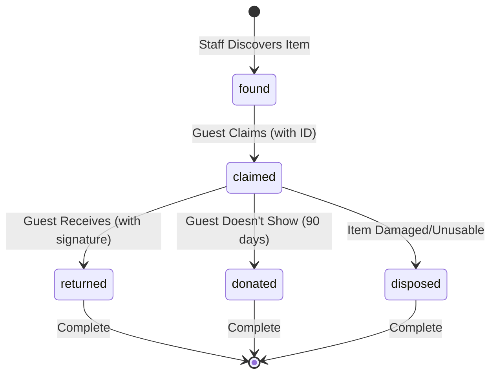
```mermaid
stateDiagram-v2
    [*] --> found: Staff Discovers Item
    found --> claimed: Guest Claims (with ID)
    claimed --> returned: Guest Receives (with signature)
    claimed --> donated: Guest Doesn't Show (90 days)
    claimed --> disposed: Item Damaged/Unusable
    returned --> [*]: Complete
    donated --> [*]: Complete
    disposed --> [*]: Complete
```

### 🔄 Data Flow

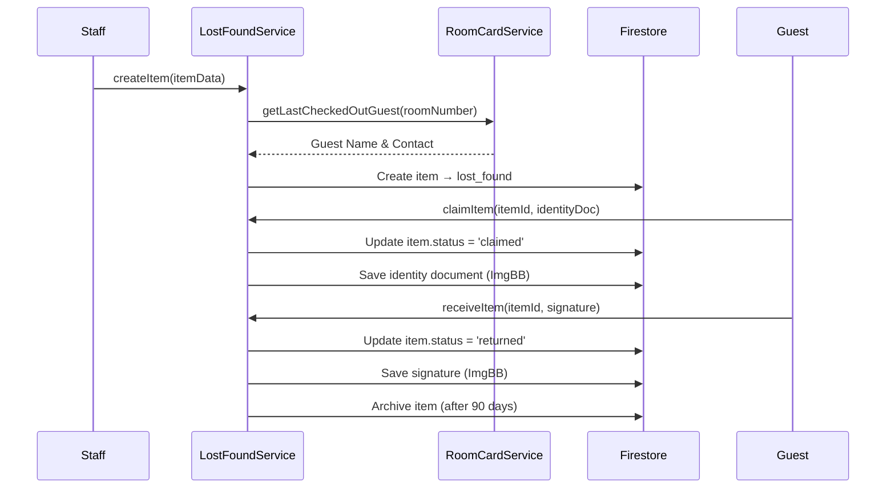
```mermaid
sequenceDiagram
    participant Staff
    participant LostFoundService
    participant RoomCardService
    participant Firestore
    participant Guest

    Staff->>LostFoundService: createItem(itemData)
    LostFoundService->>RoomCardService: getLastCheckedOutGuest(roomNumber)
    RoomCardService-->>LostFoundService: Guest Name & Contact
    LostFoundService->>Firestore: Create item → lost_found
    
    Guest->>LostFoundService: claimItem(itemId, identityDoc)
    LostFoundService->>Firestore: Update item.status = 'claimed'
    LostFoundService->>Firestore: Save identity document (ImgBB)
    
    Guest->>LostFoundService: receiveItem(itemId, signature)
    LostFoundService->>Firestore: Update item.status = 'returned'
    LostFoundService->>Firestore: Save signature (ImgBB)
    LostFoundService->>Firestore: Archive item (after 90 days)
```

### 📝 Business Rules

**1. Status Flow:**
- ✅ `found` → `claimed` → `returned` (Normal flow)
- ✅ `claimed` → `donated` (Guest doesn't show - 90 days)
- ✅ `claimed` → `disposed` (Item damaged)

**2. Identity Verification:**
- ✅ Guest must provide ID document (passport, ID card, etc.)
- ✅ ID document uploaded to ImgBB
- ✅ `guestIdentityURL` stored in item

**3. Proof of Delivery:**
- ✅ Guest must sign digital signature
- ✅ Signature stored as Base64 or ImgBB URL
- ✅ `signatureData` and `signatureUrl` stored

**4. Auto-Link to Room:**
- ✅ System searches `roomCards` for last checked-out guest
- ✅ Auto-fills `guestName` and `guestContact`
- ✅ Links `roomNumber` to item

**5. Retention Period:**
- ✅ Default: 90 days
- ✅ After retention: Archived to `lost_found_archive`

---

## 🔧 القسم 8: MAINTENANCE FLOW (تدفق الصيانة)

### 🎯 الهدف
**إدارة دورة حياة طلبات الصيانة من الإنشاء إلى الإنجاز.**

### 📊 State Machine

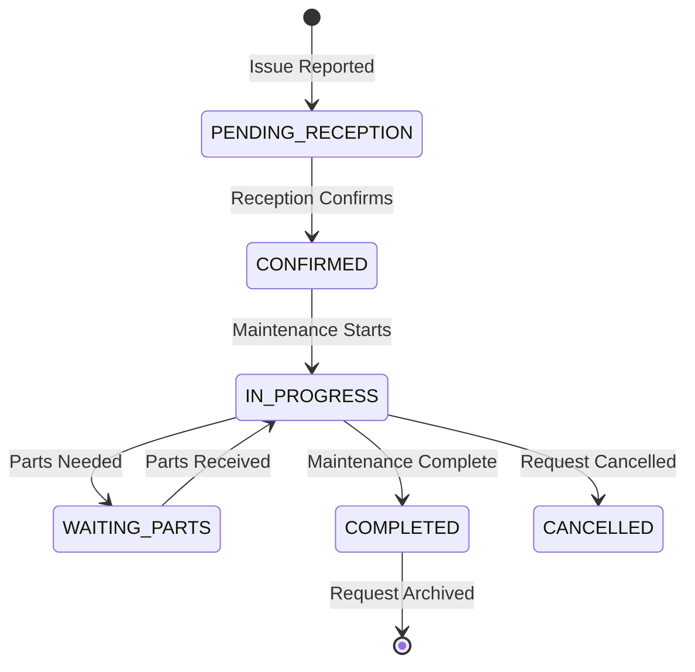
```mermaid
stateDiagram-v2
    [*] --> PENDING_RECEPTION: Issue Reported
    PENDING_RECEPTION --> CONFIRMED: Reception Confirms
    CONFIRMED --> IN_PROGRESS: Maintenance Starts
    IN_PROGRESS --> WAITING_PARTS: Parts Needed
    WAITING_PARTS --> IN_PROGRESS: Parts Received
    IN_PROGRESS --> COMPLETED: Maintenance Complete
    COMPLETED --> [*]: Request Archived
    IN_PROGRESS --> CANCELLED: Request Cancelled
```

### 🔄 Data Flow

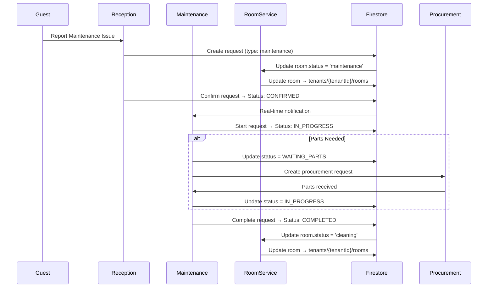
```mermaid
sequenceDiagram
    participant Guest
    participant Reception
    participant Maintenance
    participant RoomService
    participant Firestore

    Guest->>Reception: Report Maintenance Issue
    Reception->>Firestore: Create request (type: maintenance)
    Firestore->>RoomService: Update room.status = 'maintenance'
    RoomService->>Firestore: Update room → tenants/{tenantId}/rooms
    
    Reception->>Firestore: Confirm request → Status: CONFIRMED
    Firestore->>Maintenance: Real-time notification
    
    Maintenance->>Firestore: Start request → Status: IN_PROGRESS
    alt Parts Needed
        Maintenance->>Firestore: Update status = WAITING_PARTS
        Maintenance->>Procurement: Create procurement request
        Procurement->>Maintenance: Parts received
        Maintenance->>Firestore: Update status = IN_PROGRESS
    end
    
    Maintenance->>Firestore: Complete request → Status: COMPLETED
    Firestore->>RoomService: Update room.status = 'cleaning'
    RoomService->>Firestore: Update room → tenants/{tenantId}/rooms
```

### 📝 Business Rules

**1. Room Status Impact:**
- ✅ Issue reported → Room status: `maintenance`
- ✅ Maintenance complete → Room status: `cleaning`
- ✅ Cleaning complete → Room status: `available`

**2. Parts Management:**
- ✅ If parts needed → Status: `WAITING_PARTS`
- ✅ Creates procurement request automatically
- ✅ Resumes when parts received

**3. Request Lifecycle:**
- ✅ PENDING_RECEPTION → CONFIRMED → IN_PROGRESS → COMPLETED
- ✅ Can be cancelled at any time
- ✅ Points awarded on completion

---

## 📊 القسم 9: ANALYTICS FLOW (تدفق التحليلات)

### 🎯 الهدف
**حساب KPIs وتحليل الأداء والربحية.**

### 🔄 Data Flow

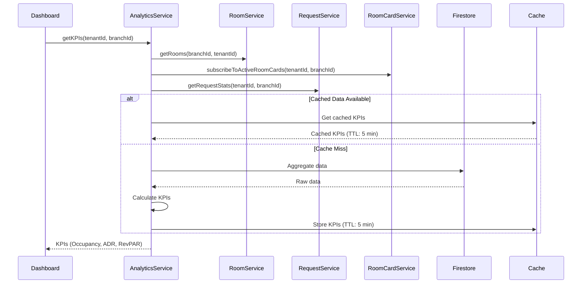
```mermaid
sequenceDiagram
    participant Dashboard
    participant AnalyticsService
    participant RoomService
    participant RequestService
    participant RoomCardService
    participant Firestore
    participant Cache

    Dashboard->>AnalyticsService: getKPIs(tenantId, branchId)
    AnalyticsService->>RoomService: getRooms(branchId, tenantId)
    AnalyticsService->>RoomCardService: subscribeToActiveRoomCards(tenantId, branchId)
    AnalyticsService->>RequestService: getRequestStats(tenantId, branchId)
    
    alt Cached Data Available
        AnalyticsService->>Cache: Get cached KPIs
        Cache-->>AnalyticsService: Cached KPIs (TTL: 5 min)
    else Cache Miss
        AnalyticsService->>Firestore: Aggregate data
        Firestore-->>AnalyticsService: Raw data
        AnalyticsService->>AnalyticsService: Calculate KPIs
        AnalyticsService->>Cache: Store KPIs (TTL: 5 min)
    end
    
    AnalyticsService-->>Dashboard: KPIs (Occupancy, ADR, RevPAR)
```

### 📝 Business Rules

**1. KPI Calculations:**
- ✅ **Occupancy Rate:** `(Occupied Rooms / Total Rooms) × 100`
- ✅ **ADR (Average Daily Rate):** `Total Revenue / Number of Rooms Sold`
- ✅ **RevPAR (Revenue Per Available Room):** `ADR × Occupancy Rate`

**2. Data Aggregation:**
- ✅ Batch processing (avoids rate limits)
- ✅ Caching strategy (TTL: 5 minutes)
- ✅ Real-time updates (onSnapshot for active data)

**3. Performance:**
- ✅ Lazy loading (only calculate when needed)
- ✅ Memoization (cache results)
- ✅ Client-side aggregation (faster)

---

## 🎯 القسم 10: STAFF ASSIGNMENT FLOW (تدفق تعيين الموظفين)

### 🎯 الهدف
**تعيين الطلبات للموظفين بناءً على العبء والأداء.**

### 🔄 Data Flow

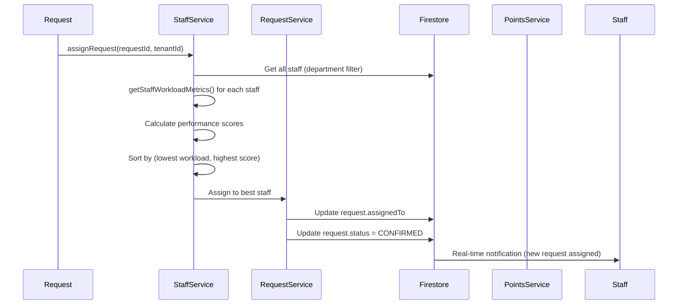
```mermaid
sequenceDiagram
    participant Request
    participant StaffService
    participant RequestService
    participant Firestore
    participant PointsService

    Request->>StaffService: assignRequest(requestId, tenantId)
    StaffService->>Firestore: Get all staff (department filter)
    StaffService->>StaffService: getStaffWorkloadMetrics() for each staff
    StaffService->>StaffService: Calculate performance scores
    StaffService->>StaffService: Sort by (lowest workload, highest score)
    StaffService->>RequestService: Assign to best staff
    RequestService->>Firestore: Update request.assignedTo
    RequestService->>Firestore: Update request.status = CONFIRMED
    Firestore->>Staff: Real-time notification (new request assigned)
```

### 📝 Business Rules

**1. Auto-Assignment Algorithm:**
- ✅ Filters staff by department
- ✅ Calculates workload (active requests count)
- ✅ Calculates performance score: `(completedToday × 0.4) + (rating × 20) - (activeRequests × 0.1)`
- ✅ Selects staff with lowest workload and highest score

**2. Manual Assignment:**
- ✅ Manager can manually assign
- ✅ Overrides auto-assignment
- ✅ Logs assignment reason

**3. Workload Balancing:**
- ✅ Distributes requests evenly
- ✅ Prevents overload on single staff
- ✅ Considers staff availability

---

## 🍺 القسم 11: MINIBAR FLOW (تدفق الميني بار)

### 🎯 الهدف
**إدارة استهلاك عناصر الميني بار وربطها بالفواتير والغرف.**

### 📊 State Machine

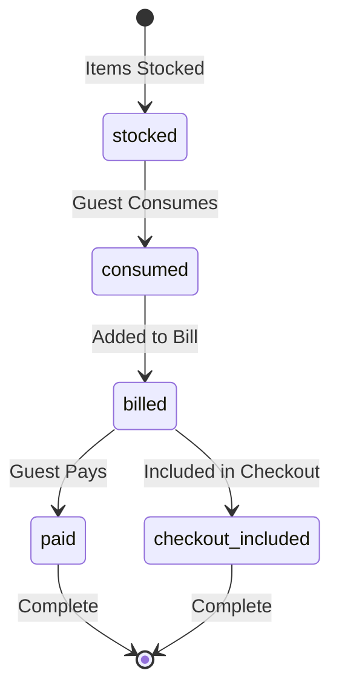
```mermaid
stateDiagram-v2
    [*] --> stocked: Items Stocked
    stocked --> consumed: Guest Consumes
    consumed --> billed: Added to Bill
    billed --> paid: Guest Pays
    billed --> checkout_included: Included in Checkout
    paid --> [*]: Complete
    checkout_included --> [*]: Complete
```

### 🔄 Data Flow

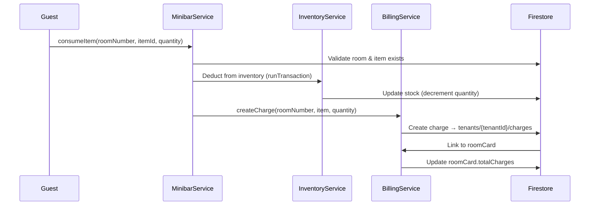
```mermaid
sequenceDiagram
    participant Guest
    participant MinibarService
    participant InventoryService
    participant BillingService
    participant Firestore

    Guest->>MinibarService: consumeItem(roomNumber, itemId, quantity)
    MinibarService->>Firestore: Validate room & item exists
    MinibarService->>InventoryService: Deduct from inventory (runTransaction)
    InventoryService->>Firestore: Update stock (decrement quantity)
    MinibarService->>BillingService: createCharge(roomNumber, item, quantity)
    BillingService->>Firestore: Create charge → tenants/{tenantId}/charges
    Firestore->>BillingService: Link to roomCard
    BillingService->>Firestore: Update roomCard.totalCharges
```

### 📝 Business Rules

**1. Consumption:**
- ✅ Guest consumes item → `consumed` status
- ✅ Inventory decremented atomically
- ✅ Charge created and linked to room

**2. Billing:**
- ✅ Charges accumulated in `roomCard.totalCharges`
- ✅ Tax applied per item category
- ✅ Included in final bill on checkout

**3. Inventory:**
- ✅ Stock tracked per room
- ✅ Low stock alerts (threshold: 20%)
- ✅ Auto-reorder when stock < minimum

---

## ☕ القسم 12: COFFEE SHOP FLOW (تدفق الكوفي شوب)

### 🎯 الهدف
**إدارة طلبات الكوفي شوب من التقديم إلى التسليم مع تحديث المخزون.**

### 📊 State Machine

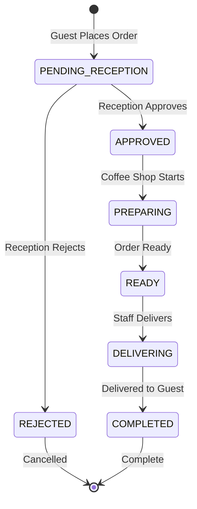
```mermaid
stateDiagram-v2
    [*] --> PENDING_RECEPTION: Guest Places Order
    PENDING_RECEPTION --> APPROVED: Reception Approves
    PENDING_RECEPTION --> REJECTED: Reception Rejects
    APPROVED --> PREPARING: Coffee Shop Starts
    PREPARING --> READY: Order Ready
    READY --> DELIVERING: Staff Delivers
    DELIVERING --> COMPLETED: Delivered to Guest
    REJECTED --> [*]: Cancelled
    COMPLETED --> [*]: Complete
```

### 🔄 Data Flow

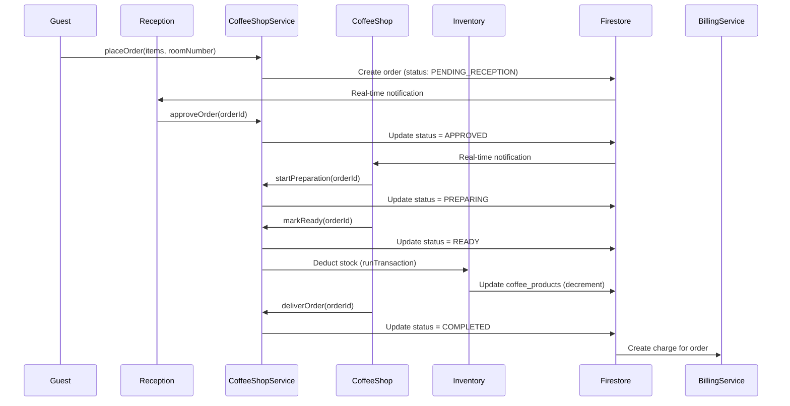
```mermaid
sequenceDiagram
    participant Guest
    participant Reception
    participant CoffeeShopService
    participant CoffeeShop
    participant Inventory
    participant Firestore

    Guest->>CoffeeShopService: placeOrder(items, roomNumber)
    CoffeeShopService->>Firestore: Create order (status: PENDING_RECEPTION)
    Firestore->>Reception: Real-time notification
    
    Reception->>CoffeeShopService: approveOrder(orderId)
    CoffeeShopService->>Firestore: Update status = APPROVED
    Firestore->>CoffeeShop: Real-time notification
    
    CoffeeShop->>CoffeeShopService: startPreparation(orderId)
    CoffeeShopService->>Firestore: Update status = PREPARING
    CoffeeShop->>CoffeeShopService: markReady(orderId)
    CoffeeShopService->>Firestore: Update status = READY
    CoffeeShopService->>Inventory: Deduct stock (runTransaction)
    Inventory->>Firestore: Update coffee_products (decrement)
    
    CoffeeShop->>CoffeeShopService: deliverOrder(orderId)
    CoffeeShopService->>Firestore: Update status = COMPLETED
    Firestore->>BillingService: Create charge for order
```

### 📝 Business Rules

**1. Order Routing:**
- ✅ Reception approves → Coffee Shop receives
- ✅ Auto-routing based on order type
- ✅ Rejection reason logged

**2. Stock Updates:**
- ✅ Stock deducted when order marked `READY`
- ✅ Low stock alerts
- ✅ Product unavailable → Order rejected

**3. Billing:**
- ✅ Charges added on completion
- ✅ Tax applied per product category
- ✅ Included in room bill

---

## 📦 القسم 13: PROCUREMENT FLOW (تدفق المشتريات)

### 🎯 الهدف
**إدارة دورة المشتريات من الطلب إلى الاستلام.**

### 📊 State Machine

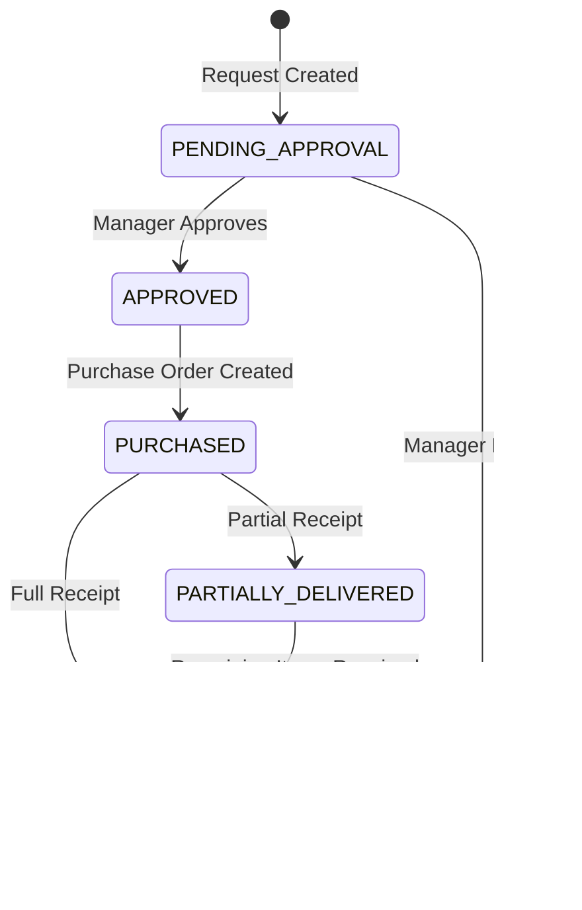
```mermaid
stateDiagram-v2
    [*] --> PENDING_APPROVAL: Request Created
    PENDING_APPROVAL --> APPROVED: Manager Approves
    PENDING_APPROVAL --> REJECTED: Manager Rejects
    APPROVED --> PURCHASED: Purchase Order Created
    PURCHASED --> PARTIALLY_DELIVERED: Partial Receipt
    PURCHASED --> DELIVERED: Full Receipt
    PARTIALLY_DELIVERED --> DELIVERED: Remaining Items Received
    DELIVERED --> [*]: Complete
    REJECTED --> [*]: Cancelled
```

### 🔄 Data Flow

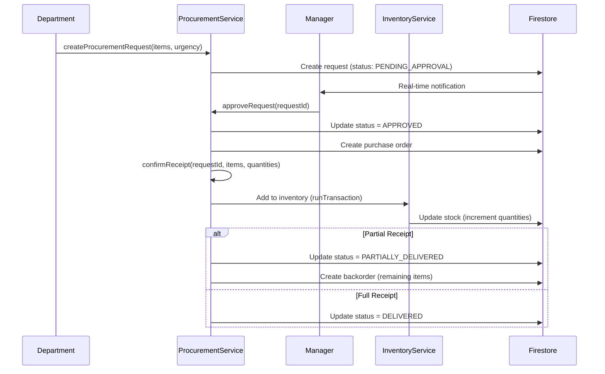
```mermaid
sequenceDiagram
    participant Department
    participant ProcurementService
    participant Manager
    participant InventoryService
    participant Firestore

    Department->>ProcurementService: createProcurementRequest(items, urgency)
    ProcurementService->>Firestore: Create request (status: PENDING_APPROVAL)
    Firestore->>Manager: Real-time notification
    
    Manager->>ProcurementService: approveRequest(requestId)
    ProcurementService->>Firestore: Update status = APPROVED
    ProcurementService->>Firestore: Create purchase order
    
    ProcurementService->>ProcurementService: confirmReceipt(requestId, items, quantities)
    ProcurementService->>InventoryService: Add to inventory (runTransaction)
    InventoryService->>Firestore: Update stock (increment quantities)
    
    alt Partial Receipt
        ProcurementService->>Firestore: Update status = PARTIALLY_DELIVERED
        ProcurementService->>Firestore: Create backorder (remaining items)
    else Full Receipt
        ProcurementService->>Firestore: Update status = DELIVERED
    end
```

### 📝 Business Rules

**1. Approval:**
- ✅ Manager must approve purchases > threshold
- ✅ Approval required for urgent requests
- ✅ Rejection reason logged

**2. Receipt:**
- ✅ Partial receipt creates backorder
- ✅ Stock updated atomically
- ✅ Points awarded for timely delivery

**3. Performance:**
- ✅ Points: Early (+2), On-time (+1), Delay (-2)
- ✅ Target time: 1 day (Housekeeping/Reception), 2 days (Maintenance)

---

## 💰 القسم 14: BILLING FLOW (تدفق الفواتير)

### 🎯 الهدف
**إدارة الفواتير متعددة الطبقات مع الضرائب والخصومات.**

### 🔄 Data Flow

```mermaid
sequenceDiagram
    participant RoomCard
    participant BillingService
    participant TaxService
    participant Firestore
    participant Guest

    RoomCard->>BillingService: Create charge (room, service, minibar)
    BillingService->>TaxService: calculateTax(amount, category)
    TaxService-->>BillingService: Tax amount
    BillingService->>Firestore: Create charge → tenants/{tenantId}/charges
    
    BillingService->>BillingService: Accumulate charges (roomCard.totalCharges)
    
    Guest->>BillingService: Apply discount(discountCode)
    BillingService->>Firestore: Update charges (apply discount)
    
    Guest->>BillingService: Checkout
    BillingService->>Firestore: Generate final bill
    BillingService->>Firestore: Update roomCard.billStatus = 'paid'
```

### 📝 Business Rules

**1. Charge Types:**
- ✅ Room charges: Nightly rate
- ✅ Service charges: Requests, amenities
- ✅ Minibar charges: Consumed items
- ✅ Extra services: Coffee shop, laundry

**2. Tax Calculation:**
- ✅ Per-category tax rates
- ✅ Inclusive/exclusive calculation
- ✅ Tax summary in bill

**3. Discounts:**
- ✅ Discount codes (percentage/fixed)
- ✅ Early check-in discount
- ✅ Late night discount
- ✅ Loyalty discount

---

## 👑 القسم 15: GUEST LOYALTY FLOW (تدفق الولاء)

### 🎯 الهدف
**إدارة نقاط النزيل ومستويات VIP والتصنيفات.**

### 📊 State Machine

```mermaid
stateDiagram-v2
    [*] --> Bronze: New Guest
    Bronze --> Silver: Points Threshold 1
    Silver --> Gold: Points Threshold 2
    Gold --> Platinum: Points Threshold 3
    Platinum --> Diamond: Points Threshold 4
    
    note right of Diamond
        Highest Tier
        Exclusive Benefits
    end note
```

### 🔄 Data Flow

```mermaid
sequenceDiagram
    participant Guest
    participant Stay
    participant LoyaltyService
    participant RatingService
    participant Firestore

    Guest->>Stay: Complete Stay
    Stay->>LoyaltyService: awardPoints(guestId, stayDuration, amount)
    LoyaltyService->>Firestore: Update guest.points (increment)
    LoyaltyService->>LoyaltyService: checkVIPLevel(points)
    LoyaltyService->>Firestore: Update guest.vipLevel (if upgraded)
    
    Guest->>RatingService: rateService(serviceId, rating)
    RatingService->>Firestore: Create rating → ratings collection
    RatingService->>LoyaltyService: awardRatingPoints(guestId, rating)
    LoyaltyService->>Firestore: Update guest.points
    
    LoyaltyService->>Firestore: Calculate respectScore(guestId)
    Firestore-->>LoyaltyService: Respect Score (based on points + ratings)
```

### 📝 Business Rules

**1. Points Award:**
- ✅ Stay duration: 1 point per night
- ✅ Spending: 1 point per 10 currency units
- ✅ Rating: Excellent (+3), Very Good (+2), Good (+1)

**2. VIP Levels:**
- ✅ Bronze: 0-100 points
- ✅ Silver: 101-500 points
- ✅ Gold: 501-1500 points
- ✅ Platinum: 1501-5000 points
- ✅ Diamond: 5001+ points

**3. Respect Score:**
- ✅ Formula: `(points × 0.5) + (averageRating × 10)`
- ✅ Updates on each stay/rating
- ✅ Used for priority service

---

## 📝 الخلاصة

### ✅ دوائر تدفق البيانات المكتملة

| القسم | الدائرة | الحالة |
|-------|---------|--------|
| Request Lifecycle | PENDING → CONFIRMED → IN_PROGRESS → COMPLETED | ✅ موثقة |
| Room Status Cycle | available → occupied → cleaning → available | ✅ موثقة |
| Points Award Flow | Request → Points → Employee → Team | ✅ موثقة |
| QR Code Flow | Generate → Validate → Access | ✅ موثقة |
| Notification Flow | System → Multi-channel | ✅ موثقة |
| Laundry Flow | Room → Dirty → Clean → Rooms | ✅ موثقة |
| Lost & Found Flow | found → claimed → returned | ✅ موثقة |
| Maintenance Flow | PENDING → IN_PROGRESS → COMPLETED | ✅ موثقة |
| Analytics Flow | Data → Aggregation → KPIs | ✅ موثقة |
| Staff Assignment Flow | Request → Workload → Assignment | ✅ موثقة |
| Minibar Flow | stocked → consumed → billed | ✅ موثقة |
| Coffee Shop Flow | PENDING → APPROVED → COMPLETED | ✅ موثقة |
| Procurement Flow | PENDING → APPROVED → DELIVERED | ✅ موثقة |
| Billing Flow | Charges → Tax → Discount → Final Bill | ✅ موثقة |
| Guest Loyalty Flow | Points → VIP Level → Respect Score | ✅ موثقة |
| **Manager Creation Flow** | **VALIDATE → CREATE → REGISTER → AUDIT** | ✅ **موثقة** |

**الإجمالي:** ✅ **16 دائرة تدفق موثقة بالكامل**

---

## 👤 القسم 16: MANAGER CREATION FLOW (تدفق إنشاء المدير)

### 🎯 الهدف
**إنشاء مدير جديد مع عزل كامل للبيانات (SaaS Multi-Tenant Model).**

### 📊 State Machine

```mermaid
stateDiagram-v2
    [*] --> VALIDATE_PIN: Owner Creates Manager
    VALIDATE_PIN --> PIN_AVAILABLE: PIN Check
    VALIDATE_PIN --> PIN_UNAVAILABLE: PIN Taken
    PIN_UNAVAILABLE --> SUGGEST_PIN: Suggest New PIN
    SUGGEST_PIN --> VALIDATE_PIN: Retry
    PIN_AVAILABLE --> CREATE_TENANT: Create Tenant
    CREATE_TENANT --> CREATE_BRANCHES: Create Branches
    CREATE_BRANCHES --> CREATE_MANAGER: Create Manager User
    CREATE_MANAGER --> REGISTER_CODES: Register Global Codes
    REGISTER_CODES --> CREATE_SETTINGS: Create Default Settings
    CREATE_SETTINGS --> SEED_ACHIEVEMENTS: Seed Achievements
    SEED_ACHIEVEMENTS --> AUDIT_LOG: Log Audit Trail
    AUDIT_LOG --> [*]: Manager Created
```

### 🔄 Data Flow

```mermaid
sequenceDiagram
    participant Owner
    participant OwnerService
    participant ValidationService
    participant Firestore
    participant TenantSeedingService
    participant AuditService

    Owner->>OwnerService: createManager(data)
    OwnerService->>ValidationService: isPinAvailable(code)
    ValidationService->>Firestore: Check globalCodes + users
    Firestore-->>ValidationService: PIN status
    
    alt PIN Available
        OwnerService->>OwnerService: Generate managerId & tenantId
        OwnerService->>OwnerService: Calculate license expiry
        OwnerService->>Firestore: writeBatch (atomic)
        
        OwnerService->>Firestore: Create Tenant → tenants/{tenantId}
        Note over Firestore: License info, branch codes, Firebase config
        
        loop For Each Branch Code
            OwnerService->>Firestore: Create Branch → tenants/{tenantId}/branches/{branchId}
            Note over Firestore: Branch code, name, status
        end
        
        OwnerService->>Firestore: Create Manager → users/{managerId}
        Note over Firestore: User data, tenantId, license info
        
        OwnerService->>Firestore: Register Master Code → globalCodes/{code}
        Note over Firestore: PIN mapping, tenantId, managerId
        
        loop For Each Branch Code
            OwnerService->>Firestore: Register Branch Code → globalCodes/{branchCode}
            Note over Firestore: Branch PIN mapping
        end
        
        OwnerService->>TenantSeedingService: seedTenantAchievements(tenantId)
        TenantSeedingService->>Firestore: Create default achievements
        
        OwnerService->>AuditService: quickAudit(MANAGER_CREATE)
        AuditService->>Firestore: Create audit log
        
        Firestore-->>OwnerService: Batch committed
        OwnerService-->>Owner: { managerId, tenantId }
    else PIN Unavailable
        OwnerService->>ValidationService: suggestUniquePin()
        ValidationService->>Firestore: Generate unique code
        Firestore-->>OwnerService: Suggested PIN
        OwnerService-->>Owner: Error + Suggested PIN
    end
```

### 📝 Business Rules

**1. PIN Validation:**
- ✅ PIN must be unique (checks `globalCodes` + `users` collections)
- ✅ If PIN taken → Suggest new unique PIN
- ✅ PIN format: 4-6 digits (configurable)
- ✅ Cannot be owner PIN (765255)

**2. Tenant Creation:**
- ✅ Each manager gets isolated tenant: `tenants/{tenantId}`
- ✅ License expiry: 1 year (normal) or 1-3 months (demo)
- ✅ License status: `active` by default
- ✅ Payment status: `pending` (normal) or `paid` (demo)
- ✅ Max branches: Configurable (default: 1)
- ✅ Firebase config: Optional (isolated database)

**3. Branch Creation:**
- ✅ At least one branch required (SaaS requirement)
- ✅ Branch codes: Assigned by owner (e.g., ['6', '7', '88'])
- ✅ Branch names: Mapped by code (e.g., { '6': 'الكورنيش' })
- ✅ Branch status: `active` by default
- ✅ First branch becomes default branch

**4. Manager User Creation:**
- ✅ Role: `manager`
- ✅ Department: `admin`
- ✅ Status: `active`
- ✅ Points: Zero state (0 points)
- ✅ Active branch: `null` (must select on first login)
- ✅ Created by: `owner`

**5. Global Code Registration:**
- ✅ Master PIN: `globalCodes/{code}` → Tenant mapping
- ✅ Branch PINs: `globalCodes/{branchCode}` → Branch mapping
- ✅ Stores essential user data (avoids reading `users` during login)
- ✅ Type: `manager`
- ✅ Status: `active`

**6. Default Settings & Seeding:**
- ✅ Achievements: Default gamification achievements
- ✅ Ranks: Default ranking system
- ✅ Points config: Default config per department
- ✅ System settings: Default values
- ✅ Feature flags: Default enabled/disabled

**7. Audit Trail:**
- ✅ Action: `MANAGER_CREATE`
- ✅ Target: `manager`
- ✅ Details: Manager name, hotel name, max branches
- ✅ Timestamp: Server timestamp
- ✅ Performed by: Owner

### 🔒 Security Rules

**1. Tenant Isolation:**
- ✅ Each tenant has isolated data space
- ✅ Firestore rules enforce tenant boundaries
- ✅ Manager can only access their own tenant

**2. PIN Security:**
- ✅ PIN is hashed (not stored in plain text)
- ✅ Global codes are read-only for non-owners
- ✅ Owner can create/manage codes
- ✅ PIN uniqueness enforced

**3. License Validation:**
- ✅ License expiry checked on login
- ✅ Expired licenses blocked from access
- ✅ Demo accounts have limited duration
- ✅ Auto-renewal configurable

### 📊 Data Schema

**Tenant Document:**
```typescript
tenants/{tenantId} = {
  info: {
    name: string,              // Hotel name
    ownerId: string,           // Manager ID
    ownerName: string,         // Manager name
    plan: 'pro' | 'free',      // Subscription plan
    status: 'active' | 'suspended' | 'expired',
    maxBranches: number,       // License limit
    branchCodes: string[],     // Assigned branch codes
    branchNames: Record<string, string>, // Branch names map
    licenseExpiry: Timestamp,  // Expiry date
    licenseStatus: 'active' | 'suspended' | 'expired',
    autoRenew: boolean,        // Auto-renewal flag
    paymentStatus: 'paid' | 'pending' | 'overdue',
    isDemo: boolean,           // Demo account flag
    firebaseConfig: {...},     // Isolated Firebase config (optional)
    hasIsolatedDatabase: boolean,
    createdAt: Timestamp,
    createdBy: 'owner'
  }
}
```

**Manager User Document:**
```typescript
users/{managerId} = {
  id: string,
  name: string,
  phone: string,               // Manager phone
  phoneBackup: string,         // Backup phone (optional)
  code: string,                // PIN code
  role: 'manager',
  department: 'admin',
  tenantId: string,            // Tenant ID (SaaS isolation)
  activeBranchId: string | null,
  branches: string[],          // Available branch IDs
  branchCodes: string[],       // Branch codes
  branchNames: Record<string, string>,
  hotelName: string,
  maxBranches: number,
  points: 0,                   // Zero state
  currentPoints: 0,
  lifetimePoints: 0,
  status: 'active',
  licenseExpiry: Timestamp,
  licenseStatus: 'active',
  paymentStatus: 'paid' | 'pending',
  isDemo: boolean,
  createdBy: 'owner',
  createdAt: Timestamp
}
```

**Global Code Document (Master PIN):**
```typescript
globalCodes/{code} = {
  tenantId: string,            // Tenant mapping
  managerId: string,           // Manager ID
  type: 'manager',
  name: string,                // Manager name
  phone: string,               // Manager phone
  phoneBackup: string,         // Backup phone
  status: 'active',
  role: 'manager',
  department: 'admin',
  licenseExpiry: Timestamp,
  licenseStatus: 'active',
  hotelName: string,
  maxBranches: number,
  branchNames: Record<string, string>,
  branchCodes: string[],
  createdAt: Timestamp,
  createdBy: 'owner'
}
```

**Global Code Document (Branch PIN):**
```typescript
globalCodes/{branchCode} = {
  tenantId: string,            // Tenant mapping
  managerId: string,           // Manager ID
  branchId: string,            // Branch ID (hint for auto-selection)
  type: 'manager',
  name: string,                // Manager name
  status: 'active',
  role: 'manager',
  department: 'admin',
  licenseExpiry: Timestamp,
  licenseStatus: 'active',
  hotelName: string,
  maxBranches: number,
  branchNames: Record<string, string>,
  branches: string[],
  branchCodes: string[],
  createdAt: Timestamp,
  createdBy: 'owner'
}
```

**Branch Document:**
```typescript
tenants/{tenantId}/branches/{branchId} = {
  code: string,                // Branch code (e.g., '6', '7')
  name: string,                // Branch name
  location: string,
  status: 'active',
  settings: {
    workingHours: string       // Default: '24/7'
  },
  createdAt: Timestamp,
  createdBy: 'owner'
}
```

### ✅ Atomic Operations

**1. Batch Write:**
- ✅ All operations in single `writeBatch`
- ✅ All-or-nothing transaction
- ✅ Prevents partial creation (data integrity)
- ✅ Rollback on failure (no orphaned data)

**2. Rollback Logic:**
- ✅ If any step fails → Entire batch rejected
- ✅ No orphaned data (tenants without managers, etc.)
- ✅ Error handling with cleanup

### 🔄 Post-Creation Flow

**1. Manager Login:**
- ✅ Manager uses PIN code to login
- ✅ System looks up `globalCodes/{code}` → Gets `tenantId`
- ✅ Loads manager data from `users/{managerId}`
- ✅ Redirects to branch selection (if no active branch)

**2. Branch Selection:**
- ✅ Manager must select active branch on first login
- ✅ Can switch branches anytime (if multiple branches)
- ✅ Branch selection stored in `activeBranchId`

**3. Data Access:**
- ✅ All queries filtered by `tenantId`
- ✅ Branch-specific queries filtered by `branchId`
- ✅ Firestore rules enforce isolation

---

## 📝 الخلاصة

### ✅ دوائر تدفق البيانات المكتملة

| القسم | الدائرة | الحالة |
|-------|---------|--------|
| Request Lifecycle | PENDING → CONFIRMED → IN_PROGRESS → COMPLETED | ✅ موثقة |
| Room Status Cycle | available → occupied → cleaning → available | ✅ موثقة |
| Points Award Flow | Request → Points → Employee → Team | ✅ موثقة |
| QR Code Flow | Generate → Validate → Access | ✅ موثقة |
| Notification Flow | System → Multi-channel | ✅ موثقة |
| Laundry Flow | Room → Dirty → Clean → Rooms | ✅ موثقة |
| Lost & Found Flow | found → claimed → returned | ✅ موثقة |
| Maintenance Flow | PENDING → IN_PROGRESS → COMPLETED | ✅ موثقة |
| Analytics Flow | Data → Aggregation → KPIs | ✅ موثقة |
| Staff Assignment Flow | Request → Workload → Assignment | ✅ موثقة |
| Minibar Flow | stocked → consumed → billed | ✅ موثقة |
| Coffee Shop Flow | PENDING → APPROVED → COMPLETED | ✅ موثقة |
| Procurement Flow | PENDING → APPROVED → DELIVERED | ✅ موثقة |
| Billing Flow | Charges → Tax → Discount → Final Bill | ✅ موثقة |
| Guest Loyalty Flow | Points → VIP Level → Respect Score | ✅ موثقة |
| **Manager Creation Flow** | **VALIDATE → CREATE → REGISTER → AUDIT** | ✅ **موثقة** |

**الإجمالي:** ✅ **16 دائرة تدفق موثقة بالكامل**

---

## 🎯 التوصية النهائية

**✅ جميع دوائر تدفق البيانات موثقة ومكتملة**

**الدوائر الموثقة:**
- ✅ Request Lifecycle
- ✅ Room Status Cycle
- ✅ Points Award Flow
- ✅ QR Code Flow
- ✅ Notification Flow
- ✅ Laundry Flow
- ✅ Lost & Found Flow
- ✅ Maintenance Flow
- ✅ Analytics Flow
- ✅ Staff Assignment Flow
- ✅ Minibar Flow
- ✅ Coffee Shop Flow
- ✅ Procurement Flow
- ✅ Billing Flow
- ✅ Guest Loyalty Flow
- ✅ **Manager Creation Flow** (NEW)

**الحالة:** ✅ **DOCUMENTATION COMPLETE - 100% (16/16 Circles)**

---

**تاريخ التوثيق:** 2026-01-16  
**القائد التقني:** Senior Full-Stack Engineer  
**الحالة:** ✅ **DATA FLOW DOCUMENTATION COMPLETE**
