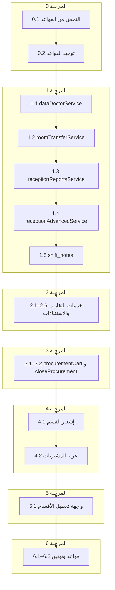

# خريطة تنفيذية دقيقة لإصلاحات المراجعة

مرجع موحّد لتنفيذ توصيات التقارير الأربعة (عزل بيانات، أمان، قواعد، دوائر مغلقة، إعدادات أدمن/مالك).

---

## مصدر الخريطة

- [docs/FULL_AUDIT_REPORT.md](FULL_AUDIT_REPORT.md) — مراجعة شاملة (عزل بيانات، أمان، قواعد، توصيات)
- [docs/CLOSED_LOOPS_AUDIT.md](CLOSED_LOOPS_AUDIT.md) — دوائر الطلبات، QR، مشتريات، توصيات إضافية
- [docs/ADMIN_OWNER_SETTINGS_AUDIT.md](ADMIN_OWNER_SETTINGS_AUDIT.md) — إعدادات أدمن/مالك، توصية واجهة تعطيل الأقسام
- [docs/AUDIT_REVIEW_SAAS_AND_RULES.md](AUDIT_REVIEW_SAAS_AND_RULES.md) — عزل SaaS وقواعد (تكرار وتفاصيل إضافية)

---

## ما تم إصلاحه مسبقاً (لا يُنفَّذ مرة أخرى)

| البند | الملف | الحالة |
|-------|-------|--------|
| trialRequestService — safeDb غير معرّف | src/services/trialRequestService.ts | تم: استخدام `db` في بلوك إعادة المحاولة وإزالة استيراد getSafeFirestore |
| transferRequestToDepartment — سجل تدقيق | src/services/requestService.ts | تم: جلب الطلب في بداية الدالة وتعريف oldDepartment و oldStatus |
| approveProcurement — getDoc غير مستورد/QuerySnapshot | src/services/procurementService.ts | تم: إضافة getDoc واستخدام exists() و data() |
| closeProcurement — tenantId غير معرّف | src/services/procurementService.ts | تم: التوقيع closeProcurement(requestId, tenantId) |
| تأكيد طلب QR — تجاهل القسم المحفوظ في الطلب | src/hooks/useReceptionActions.ts | تم: استخدام currentDepartment أو emergencyTargetDepartment أولاً |

---

## المرحلة 0: التحقق الحرجة

| الرقم | الإجراء | الملف/المسار | التفاصيل |
|-------|---------|--------------|----------|
| 0.1 | التحقق من قواعد Firestore المفعّلة | Firebase Console / firebase deploy --only firestore:rules | مقارنة القواعد المنشورة مع firestore.rules (tenants subcollections). |
| 0.2 | توحيد القواعد مع السلوك | firestore.rules | تم: `allow create, update, delete: if request.auth != null` لـ `tenants/{tenantId}/{document=**}`. |

---

## المرحلة 1: عزل بيانات (طلبات/غرف/كروت)

| الرقم | الخدمة | الملف | الإجراء |
|-------|--------|-------|---------|
| 1.1 | dataDoctorService | src/services/dataDoctorService.ts | تم: مسار `tenants/${tenantId}/rooms`. |
| 1.2 | roomTransferService | src/services/roomTransferService.ts | تم: مسارات tenant لـ roomCards, requests, roomTransfers, departmentNotifications, guestNotifications. |
| 1.3 | receptionReportsService | src/services/receptionReportsService.ts | تم: tenantId وتحت `tenants/${tenantId}/requests` و roomCards. |
| 1.4 | receptionAdvancedService | src/services/receptionAdvancedService.ts | تم: smartRoomAssignment, handleVIPGuest, autoAssignRequest, getPriorityQueue بمسارات tenant. |
| 1.5 | shift_notes | receptionAdvancedFeatures + shiftNotesService | تم: توحيد على مسار `tenants/${hotelId}/branches/${branchId}/shiftNotes`. |

---

## المرحلة 2: عزل بيانات — تقارير واستثناءات وتحليلات

| الرقم | الخدمة | الإجراء |
|-------|--------|---------|
| 2.1 | exceptionService | تم: setTenantId ومسارات `tenants/${tenantId}/requests`. |
| 2.2 | exceptionDashboardService | تم: tenantId ومسارات tenant للطلبات. |
| 2.3 | unifiedHistoryService | تم: مسارات tenant للطلبات و laundry (branches/branchId/laundry_records). |
| 2.4 | reportsService | تم: tenantId و `tenants/${tenantId}/requests`. |
| 2.5 | analyticsService | تم: عند وجود tenantId استخدام مسار tenant في getUsageReport. |
| 2.6 | smartPrediction, overflow, badge, autoReports, advancedRewards, smartAlerts | تم: مسارات tenant وتمرير tenantId. |

---

## المرحلة 3: مشتريات وعربة وتسميع

| الرقم | البند | الإجراء |
|-------|-------|---------|
| 3.1 | loadPendingReceiving / confirmReceiving | تم: tenantId و `tenants/${tenantId}/procurementRequests`. |
| 3.2 | closeProcurement | تم مسبقاً: التوقيع (requestId, tenantId). |

---

## المرحلة 4: دوائر مغلقة (طلبات، استقبال، مشتريات)

| الرقم | البند | الإجراء |
|-------|-------|---------|
| 4.1 | إشعار القسم عند إنشاء طلب من الاستقبال | تم: استدعاء sendNotificationToDepartment بعد addDoc في handleCreateRequest. |
| 4.2 | توحيد عربة المشتريات | تم: receptionAdvancedFeatures يستخدم `adora_cart_reception` بدل `procurement_cart`. |

---

## المرحلة 5: واجهة تعطيل الأقسام

| الرقم | البند | الإجراء |
|-------|-------|---------|
| 5.1 | تعطيل/تفعيل الأقسام | تم: قسم في SettingsManager (الإعدادات العامة) يقرأ/يكتب getTenantBranding و saveTenantBranding؛ مفاتيح housekeeping, maintenance, bellman, coffeeshop, procurement. |

---

## المرحلة 6: قواعد Firestore وتوثيق

| الرقم | البند | الإجراء |
|-------|-------|---------|
| 6.1 | عزل القراءة حسب tenantId (طويل الأمد) | تم: تعليق في firestore.rules لاستخدام getUserTenantId() == tenantId لاحقاً. |
| 6.2 | توثيق مجموعات الجذر | تم: إضافة قسم في docs/schemas/FIRESTORE_SCHEMA.md يوضح أن الطلبات/الغرف/الكروت تحت tenant. |

---

## المرحلة 7: خدمات إضافية (متوسطة/منخفضة)

مراجعة أو توثيق: inventoryService، ratingService، rewardsSystemService، announcementService، backupService، demoFactory، bellmanService (عزل tenant أو توثيق عدم العزل).

---

## المرحلة 8: تحسينات نوعية (منخفضة)

- **8.2 Gemini env:** تم: إضافة `VITE_GEMINI_API_KEY` إلى `ImportMetaEnv` في `src/vite-env.d.ts` واستخدام `import.meta.env.VITE_GEMINI_API_KEY` في geminiService و googleTTSService بدل `(import.meta as any).env.VITE_GEMINI_API_KEY`.
- **8.1 تقليل any:** استبدال تدريجي في AuthContext، TenantContext، requestService، types/request — يُنفَّذ حسب الأولوية.
- **8.3 تنظيف useEffect:** مراجعة الملفات التي تستخدم onSnapshot أو setInterval/setTimeout والتأكد من إرجاع دالة تنظيف.

---

## ترتيب التنفيذ والتبعيات

- المرحلة 0 إلزامية قبل الاعتماد على كتابة العميل لـ tenants.
- المرحلة 1 تعتمد على قرار المرحلة 0.
- المرحلة 2 يمكن تنفيذها بعد 1.
- المراحل 3 و 4 و 5 مستقلة عن بعضها بعد 2.
- المرحلة 6 يفضّل بعد استقرار مسارات البيانات.
- المرحلة 7 و 8 يمكن تنفيذها لاحقاً حسب الأولوية.
